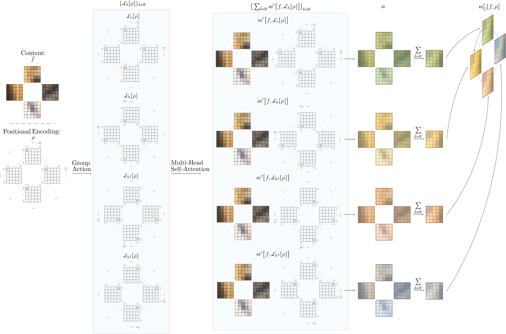

## Group Equivariant Stand-Alone Self-Attention For Vision

This repository contains the source code accompanying the paper:

 [Group Equivariant Stand-Alone Self-Attention For Vision](https://openreview.net/forum?id=JkfYjnOEo6M) [[Slides]](https://app.slidebean.com/p/5ph9ysn3g7/Group-Equivariant-Stand-Alone-Self-Attention-For-Vision) [[Demos]](https://github.com/dwromero/g_selfatt/tree/master/demo) <br/>**[David W. Romero](https://www.davidromero.ml/) & [Jean-Baptiste Cordonnier](http://jbcordonnier.com/)**, ICLR 2021.

#### Abstract
*We provide a general self-attention formulation to impose group equivariance to arbitrary symmetry groups. This is achieved by defining positional encodings that
are invariant to the action of the group considered. Since the group acts on the positional encoding directly, group equivariant self-attention networks (**GSA-Nets**) are
steerable by nature. Our experiments on vision benchmarks demonstrate consistent improvements of GSA-Nets over non-equivariant self-attention networks.*



### Repository structure

This repository is organized as follows:

* `g_selfatt` contains the main PyTorch library of our model.

* `datasets` implements `Dataset` wrappers for the datasets used.

* `demo` includes some minimalistic examples on the usage of our approach as well as the construction of Group Equivariant Self-Attention Networks (GSA-Nets).
    These files also demonstrate empirically the equivariance properties of our model.

* `models` contains the models used throughout our experiments.

* `runs` contains the command lines used to obtain the results reported in our experiments.

* `saved` contains various pretrained models.

### Reproduce

#### Install

###### conda *(recommended)*
In order to reproduce our results, please first install the required dependencies. This can be done by:
```
conda env create -f conda_requirements.txt
```
This will create the conda environment `g_selfatt` with the correct dependencies.

###### pip
The same conda environment can be created with `pip` by running:
```
conda create -n g_selfatt python=3.7
conda activate g_selfatt
conda install pytorch==1.6.0 torchvision==0.7.0 cudatoolkit=10.1 -c pytorch
pip install -r requirements.txt
```

#### Data
When running experiments on **rotMNIST** or **CIFAR10**, the data will be downloaded automatically. For the **PCam** dataset, though, this needs to be done manually (Dataset size = ~7GB).

###### Pcam
We use an `ImageFolder` structure for our experiments. A file containing the entire dataset in this format can be downloaded from: https://drive.google.com/file/d/1THSEUCO3zg74NKf_eb3ysKiiq2182iMH/view?usp=sharing (~7GB).
Once downloaded, please extract the data in `./data`.

The dataset structure should look as follows:
```
./data
+-> PCam
    +--> test
    |     +--> no_tumor
    |     +--> tumor
    +--> train
    |     +--> no_tumor
    |     +--> tumor
    +--> valid
         +--> no_tumor
         +--> tumor
```

#### Experiments and `config` files
To reproduce the experiments in the paper, please follow the configurations given in `runs/README.md`

Specifications on the parameters specified via the `argsparser` can be found in the corresponding `config.py` file.

#### Pretrained models
To use pretrained models, please add the argument `--config.pretrained=True` to the corresponding execution line.

#### Recommendations and details

###### Automatic mixed precision and divergence during training
We leveraged atomatic mixed precision (AMP) `torch.cuda.amp` in some of our experiments , i.e., on the rotMNIST dataset.
We observed that using AMP simultaneously with learning rate schedulers made all our models diverge. Therefore, we
**disable AMP** whenever learning rate schedulers are used.

###### mlp_encoding and  `torch.nn.Embedding` for positional encodings
Our initial experiments used a `torch.nn.Embedding` layer as positional encoding. However, this type of layer does not allow
for rotations finer than 90 degrees. We solve this by replacing `torch.nn.Embedding` layers with a small MLP.

### Using Group Equivariant Self-Attention Networks
We provide a simplified version of the code used to construct GSA-Nets, which you can easily incorporate in your own project in `demo/Construct_your_own_GSA-Net.ipynb`.

### Cite
If you found this work useful in your research, please consider citing:
```
@inproceedings{romero2021group,
  title={Group Equivariant Stand-Alone Self-Attention For Vision},
  author={David W. Romero and Jean-Baptiste Cordonnier},
  booktitle={International Conference on Learning Representations},
  year={2021},
  url={https://openreview.net/forum?id=JkfYjnOEo6M}
}
```

### Acknowledgements
*We gratefully acknowledge Robert-Jan Bruintjes, Fabian Fuchs, Erik Bekkers, Andreas Loukas,
Mark Hoogendoorn and our anonymous reviewers for their valuable comments on early versions of this work. David W. Romero
is financed as part of the Efficient Deep Learning (EDL) programme (grant number P16-25), partly
funded by the Dutch Research Council (NWO) and Semiotic Labs. Jean-Baptiste Cordonnier is
financed by the Swiss Data Science Center (SDSC). Both authors are thankful to everyone
involved in funding this work. This work was carried out on the Dutch national e-infrastructure with
the support of SURF Cooperative.*