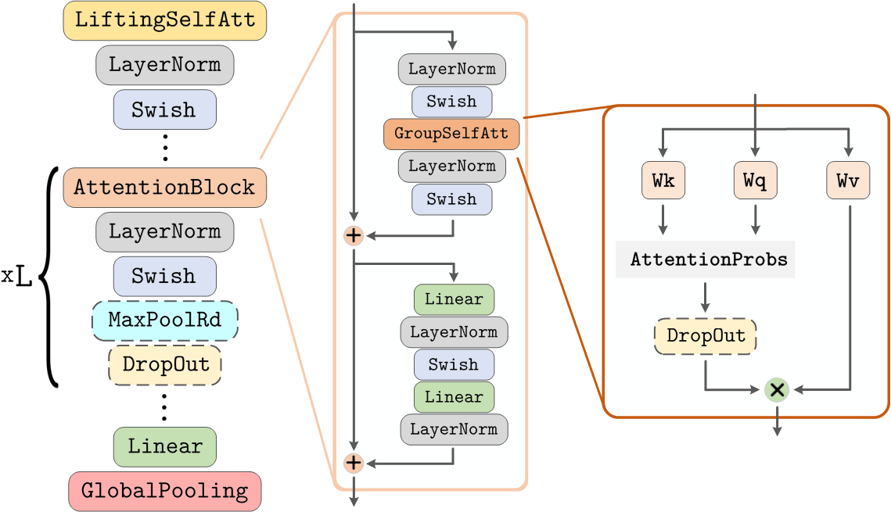

#### DEMOs
In this folder, you can find several didactic examples that demonstrate the construction of lifting and group self-attention layers (See files starting as `0_*`).
In this examples, we additionally explore the equivariance properties of these small networks and illustrate that indeed they are equivariant to the groups considered.

In addition, we provide the file `construct_your_own_GSA-Net.ipynb` in which we illustrate how to construct a simple group equivariant self-attention network (GSA-Net) with the transformer blocks used in our experiments:

As no argument-dependent handling of the arguments is required, the resulting code is much simpler. However, if you would like to reproduce the results reported in our experiments, we refer you to the main code.